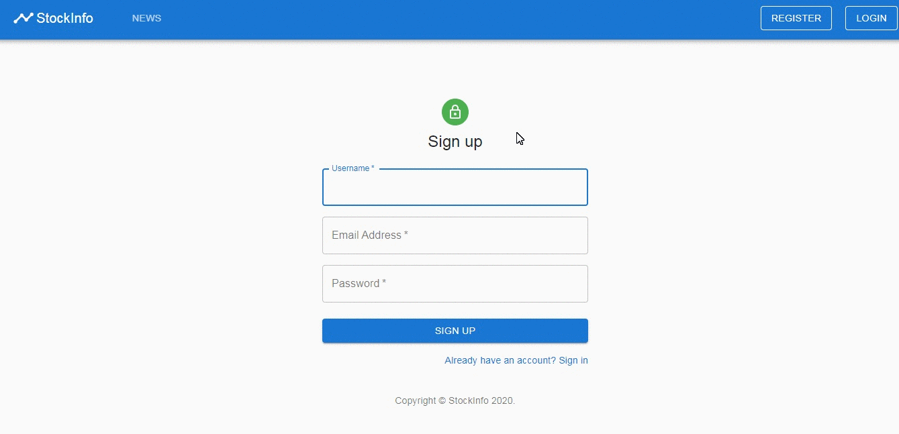

# Stock-info - project summary
## Table of contents
* [Description](#description)
* [Technologies used](#technologies-used)
* [Setup](#setup)
* [Demo](#demo)
## Description
Stock-info is a school project for the subject Web programming on the Faculty of Computer Science and Engineering - Skopje. The project is a web application about news and information. This is the client-side application.  
Filip Petrushevski  
Student ID number: 171516
## Technologies used
- ReactJs Application
- Material UI
## Setup
- Open terminal / console
- Navigate to the application root directory
- Run `npm install` and `npm start`
## Demo
